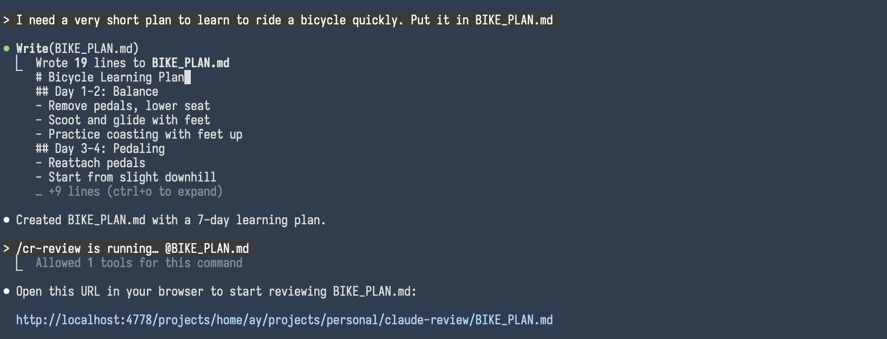
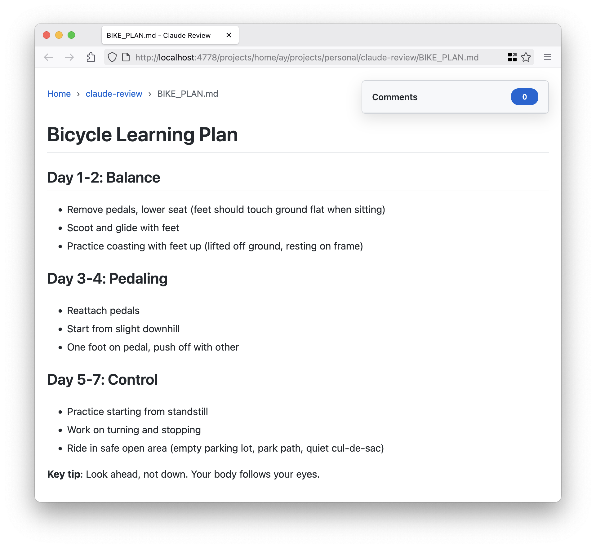

# claude-review Example Workflow

## Starting the Review Interface

Ask Claude Code the generate a Markdown document, then use the `/cr-review <FILENAME>` command to open the Markdown file
in the web interface:

## Adding Comments

Highlight text in the rendered Markdown and add inline comments:

## Addressing Comments

Use the `/cr-address` command to pull unresolved comments into Claude Code and address them:

## Updated Document

After addressing comments, the document is automatically updated and reloaded in the browser:

